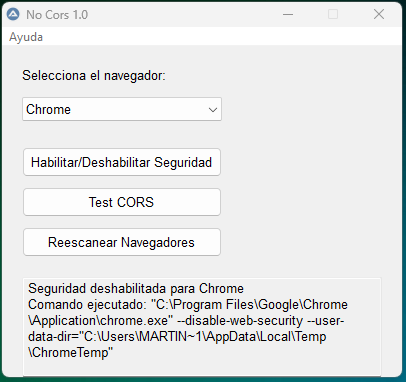

# No CORS Script

 

## Descripción

El script **No CORS** es una herramienta diseñada para facilitar pruebas de desarrollo al **deshabilitar la seguridad de los navegadores** (como Chrome, Edge, Opera, Brave, Vivaldi y Firefox). Esto es especialmente útil para trabajar con **CORS (Cross-Origin Resource Sharing)**. El script también incluye una función para **probar CORS** y verificar su estado, así como un menú "Acerca de" con los créditos del proyecto.

## Características

- **Deshabilitar seguridad**: Ejecuta el navegador seleccionado con la seguridad deshabilitada.
- **Test CORS**: Realiza una prueba para verificar si CORS está habilitado o deshabilitado.
- **Reescanear navegadores**: Detecta automáticamente los navegadores instalados en el sistema.
- **Interfaz gráfica**: Fácil de usar con una interfaz intuitiva.
- **Créditos**: Muestra información sobre los autores y el propósito del script.

## Navegadores compatibles

- Google Chrome
- Microsoft Edge
- Opera
- Brave
- Vivaldi
- Mozilla Firefox

## Requisitos

- **Sistema operativo**: Windows
- **AutoIt**: El script está escrito en AutoIt, por lo que necesitas tener instalado el intérprete de AutoIt para ejecutarlo.

## Instalación

1. Clona este repositorio o descarga el archivo `.au3`.
2. Asegúrate de tener instalado [AutoIt](https://www.autoitscript.com/site/autoit/downloads/).
3. Ejecuta el script `No_CORS_Script.au3`.

## Uso

1. Abre el script.
2. Selecciona el navegador que deseas usar.
3. Haz clic en **Habilitar/Deshabilitar Seguridad** para ejecutar el navegador con la seguridad deshabilitada.
4. Usa **Test CORS** para verificar el estado de CORS.
5. Selecciona **Reescanear Navegadores** para detectar los navegadores instalados.

## Capturas de pantalla

## Créditos

- **Autor**: Martin Alejandro Oviedo
- **Colaboración**: DeepSeek-V3
- **Versión**: 1.0
- **Año**: 2023
- **Desarrollado para**: NDAWEB Argentina

## Licencia

Este proyecto está bajo la licencia **MIT**. Para más detalles, consulta el archivo [LICENSE](LICENSE).

